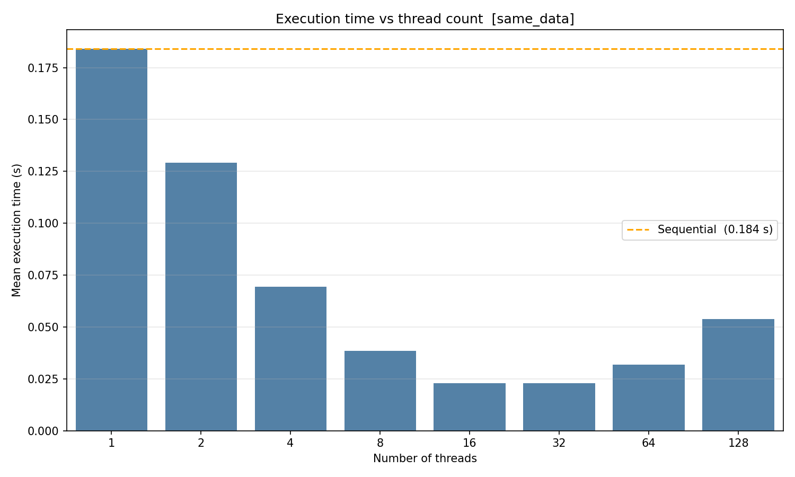
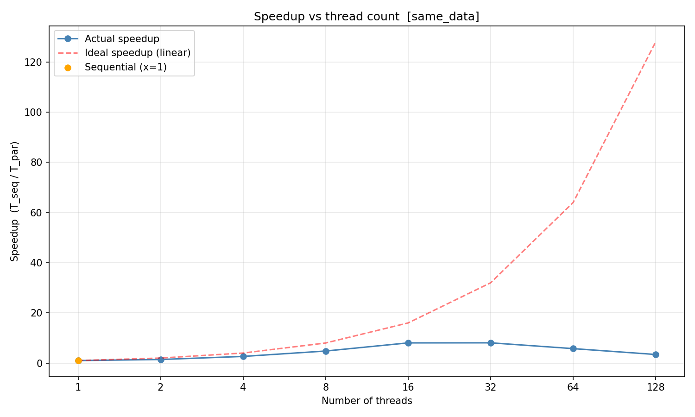
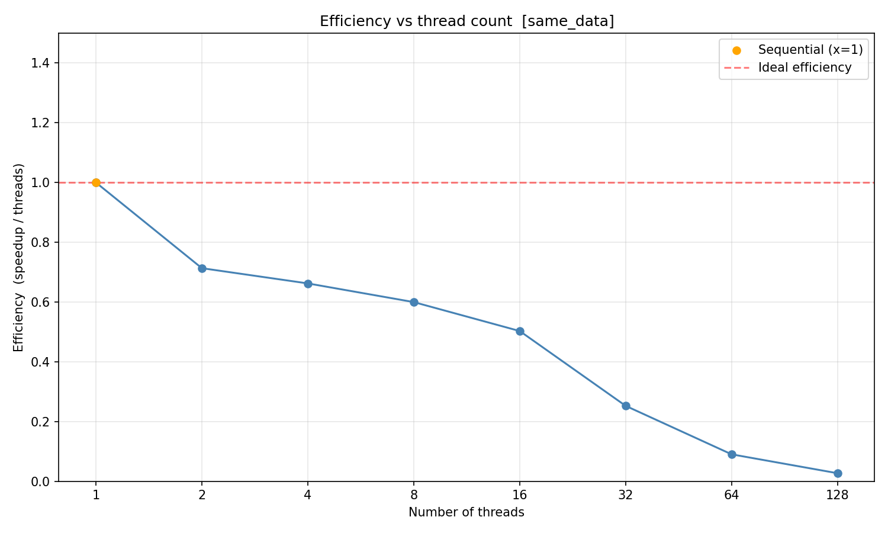
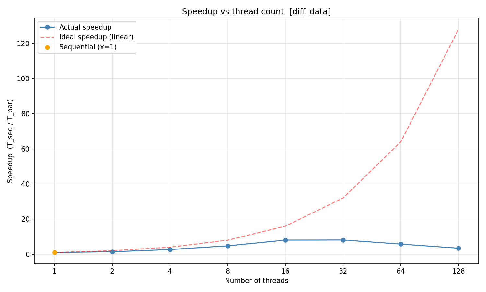
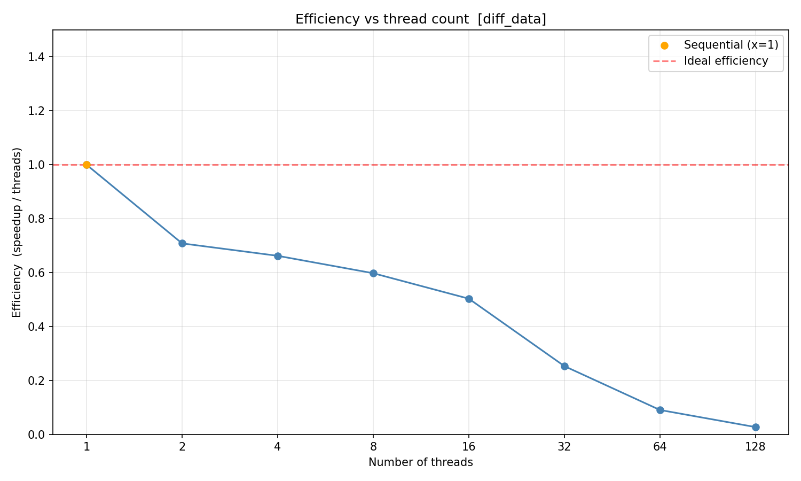

# Лабораторная работа №1
## Параллельные вычисления и пределы масштабирования

---

## 1. Задача

**Задача о разорении игрока (Gambler's Ruin)**: игрок начинает с начальным капиталом `k`, на каждом шаге выигрывает 1 с вероятностью `p` или проигрывает 1 с вероятностью `1 − p`. Игра заканчивается, когда капитал достигает 0 (разорение) или целевого значения `N` (победа). Задача — оценить вероятность разорения методом Монте-Карло, усреднив исходы по `M` независимым играм.

Аналитическое решение при `p ≠ 0.5`:

```
P(разорение | k) = (1 − (p/(1−p))^k) / (1 − (p/(1−p))^N)
```

Monte Carlo-оценка вычисляется по сетке параметров `(k, p)`:

| Параметр | Описание | Значения |
|----------|----------|----------|
| `k` | Начальный капитал | 10, 20, 30, 40, 50 |
| `p` | Вероятность выигрыша за ход | 0.30, 0.40, 0.45, 0.50, 0.55, 0.60, 0.70 |
| `N` | Целевой капитал (победа) | 100 |
| `M` | Количество игр на конфигурацию | 2000 |

Итого: **35 конфигураций** (5 × 7) на каждый входной файл. Одна итерация бенчмарка — обход всех 35 конфигураций, в сумме 70 000 игр.

---

## 2. Запуск

```bash
# Создать и активировать виртуальное окружение с зависимостями
python3 -m venv env
source env/bin/activate
pip install -r requirements.txt

# Запустить полный пайплайн (сборка + бенчмарк + графики)
chmod +x run.sh
./run.sh
```

### Стабильность частоты CPU

Перед запуском бенчмарков `run.sh` переводит все ядра в режим `performance` (фиксированная максимальная частота) через `scaling_governor`. После завершения (в том числе при ошибке) скрипт автоматически возвращает режим `powersave`. Это устраняет предупреждение Google Benchmark о динамическом изменении частоты и обеспечивает воспроизводимые результаты.

> Для этого требуется `sudo`. Если права недоступны, скрипт завершится с ошибкой на этом шаге.

`run.sh` последовательно:
1. Генерирует входные данные (`data/*.bin`), если их нет
2. Собирает проект через CMake в `build/` с флагами `-O3 -g -fno-omit-frame-pointer`
3. Запускает `bench_sequential` и `bench_parallel` на **одних данных** (`same_data.bin`) → `results/same_data.csv`
4. Запускает те же бенчмарки на **разных данных** (`seq_data.bin` / `parallel_data.bin`) → `results/diff_data.csv`
5. Строит 6 графиков через `draw_plots.py`

### Переменные окружения

| Переменная | Описание |
|------------|----------|
| `BENCH_SEQ_DATA` | Путь к бинарному файлу с конфигурациями для sequential |
| `BENCH_PAR_DATA` | Путь к бинарному файлу с конфигурациями для parallel |
| `BENCH_OUTPUT_CSV` | CSV-файл для записи результатов итерации |

---

## 3. Реализация

### Формат данных

Бинарный файл: `int64_t` (число конфигураций) + массив структур `Config` по 16 байт каждая:

```cpp
struct Config {
    int32_t initial_capital;  // k: начальный капитал
    float win_prob;           // p: вероятность выигрыша
    int32_t target;           // N: целевой капитал
    int32_t num_games;        // M: игр на конфигурацию
};
```

Генерация (Python):
```python
for k in [10, 20, 30, 40, 50]:
    for p in [0.30, 0.40, 0.45, 0.50, 0.55, 0.60, 0.70]:
        f.write(struct.pack("<ifii", k, p, 100, 2000))
```

### Последовательная реализация

Один поток обходит все `M` игр для каждой конфигурации подряд. ГПСЧ инициализируется детерминированным seed'ом (равным индексу конфигурации):

```cpp
static double simulate_ruin_seq(const Config& cfg, uint64_t seed)
{
    std::mt19937_64 rng(seed);
    std::bernoulli_distribution flip(cfg.win_prob);

    int ruined = 0;
    for (int g = 0; g < cfg.num_games; ++g) {
        int capital = cfg.initial_capital;
        while (capital > 0 && capital < cfg.target)
            capital += flip(rng) ? 1 : -1;
        if (capital == 0) ++ruined;
    }
    return static_cast<double>(ruined) / cfg.num_games;
}
```

### Параллельная реализация

`M` игр конфигурации делятся на равные чанки по числу потоков. Поток `t` использует seed `config_seed + t`, что обеспечивает детерминированность и независимость RNG потоков без мьютексов. После завершения всех потоков локальные счётчики суммируются:

```cpp
static double simulate_ruin_par(const Config& cfg,
                                uint64_t seed,
                                size_t num_threads)
{
    const int chunk = (cfg.num_games + static_cast<int>(num_threads) - 1)
                      / static_cast<int>(num_threads);
    std::vector<int> local_ruined(num_threads, 0);
    std::vector<std::thread> threads;

    for (size_t t = 0; t < num_threads; ++t) {
        const int begin = static_cast<int>(t) * chunk;
        const int end   = std::min(begin + chunk, cfg.num_games);
        if (begin >= end) break;

        threads.emplace_back([&, t, begin, end]() {
            std::mt19937_64 rng(seed + t);
            std::bernoulli_distribution flip(cfg.win_prob);
            int ruined = 0;
            for (int g = begin; g < end; ++g) {
                int capital = cfg.initial_capital;
                while (capital > 0 && capital < cfg.target)
                    capital += flip(rng) ? 1 : -1;
                if (capital == 0) ++ruined;
            }
            local_ruined[t] = ruined;
        });
    }

    for (auto& th : threads) th.join();

    int total = 0;
    for (int r : local_ruined) total += r;
    return static_cast<double>(total) / cfg.num_games;
}
```

### Параметры бенчмарка

| Параметр | Значение |
|----------|----------|
| Итерации | 150 |
| Таймер | ручной (`UseManualTime`) |
| Потоки (parallel) | 2, 4, 8, 16, 32, 64, 128 |
| Единица времени | микросекунды |

Последовательный бенчмарк всегда выполняется в одном потоке и служит базой для расчёта ускорения и эффективности.

---

## 4. Эксперименты

Для каждого CSV строятся три графика:
- **Время** — bar chart: ось X = число потоков (1, 2, 4, 8, 16, 32, 64, 128), ось Y = среднее время в секундах; столбец при threads=1 соответствует sequential-базовой линии, которая также показана пунктиром.
- **Ускорение** — line chart: `S(p) = T_seq / T_par(p)`, sequential закреплён в точке (1, 1.0).
- **Эффективность** — line chart: `E(p) = S(p) / p`, sequential закреплён в точке (1, 1.0).

Выбросы отсекаются по квантилям [1%, 99%] перед усреднением.

### Эксперимент 1: одни данные (same data)

Sequential и parallel читают один и тот же файл `same_data.bin`. Sequential-время ~0.185 с. Ускорение растёт до 16–32 потоков (~8×), после чего снижается из-за накладных расходов на создание `std::thread`.







### Эксперимент 2: разные данные (different data)

Sequential читает `seq_data.bin`, parallel — `parallel_data.bin`. Файлы содержат одинаковые конфигурации, но генерируются независимо. Результаты практически совпадают с экспериментом 1, что подтверждает: узкое место — вычисления, а не совместный доступ к данным.






---

## 5. Выводы

- **Ускорение реально, но далеко от линейного.** Sequential-базовая линия — ~0.185 с. При 2 потоках время падает до ~0.130 с (ускорение ~1.4×), при 8 — до ~0.038 с (~4.9×), при 16–32 потоках достигается пик ~0.023 с (~8×). Реальное ускорение существенно отстаёт от идеального из-за накладных расходов на создание `std::thread` и сбор результатов.

- **После 32 потоков производительность деградирует.** При 64 потоках время растёт до ~0.031 с, при 128 — до ~0.054 с, что хуже, чем при 2 потоках. Это говорит о том, что overhead на создание 64–128 объектов `std::thread` превышает выигрыш от распараллеливания при данном размере задачи (35 конфигураций × 2000 игр).

- **Эффективность монотонно убывает.** При 2 потоках — ~0.71, при 8 — ~0.60, при 32 — ~0.25, при 128 — ~0.02. Использование большого числа потоков нецелесообразно: каждый поток получает слишком мало работы.

- **Влияние общих данных минимально.** Результаты экспериментов same_data и diff_data совпадают: входные данные кешируются в RAM до старта бенчмарка, поэтому разделение файлов не даёт эффекта. Узкое место — вычисления, а не доступ к данным.

- **Оптимальная точка** при данном размере задачи — 16–32 потока. Дальнейшее увеличение числа потоков контрпродуктивно из-за overhead'а `std::thread`.
