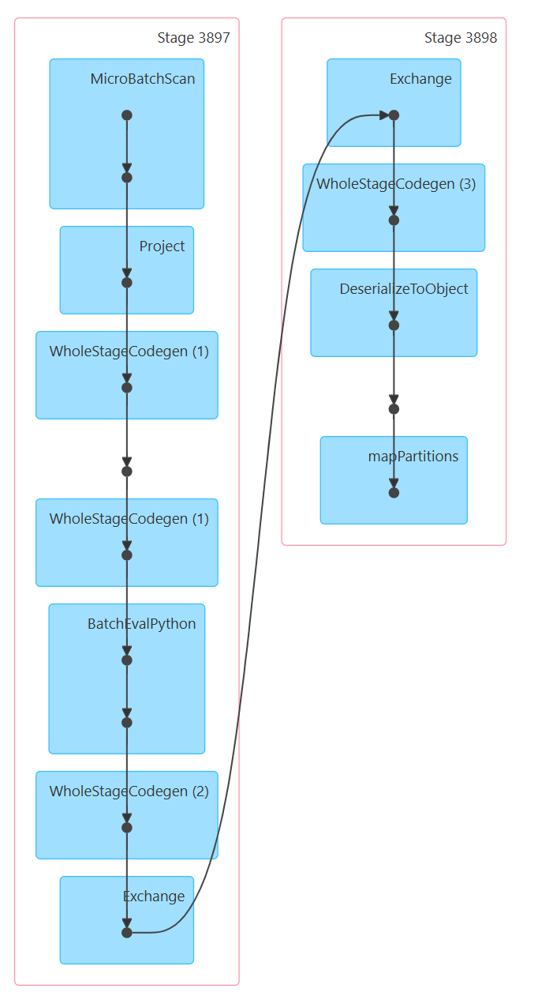
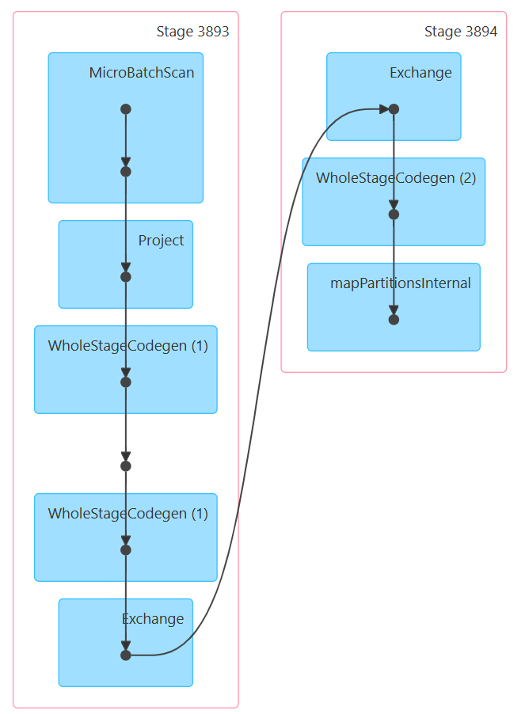

# Лабораторная работа №2
## Стриминговый пайплайн обработки данных на Apache Spark

## 1. Задача

Реализовать стриминговый пайплайн:
- Продюсер читает CSV-датасет и циклически отправляет строки в Kafka.
- Spark читает топик Kafka каждые 10 секунд, фильтрует данные, применяет UDF и сохраняет результаты в PostgreSQL.
- PostgreSQL инициализируется через `init.sql` перед запуском.

## 2. Датасет

**Daily Temperature of Major Cities** (`city_temperature.csv`) с Kaggle.

| Поле           | Тип    | Описание                             |
|----------------|--------|--------------------------------------|
| Region         | string | Регион (Europe, Asia, Africa и т.д.) |
| Country        | string | Страна                               |
| State          | string | Штат (для США, иначе пустое)         |
| City           | string | Город                                |
| Month          | int    | Месяц (1–12)                         |
| Day            | int    | День (1–31)                          |
| Year           | int    | Год                                  |
| AvgTemperature | double | Средняя температура за день (°F)     |

## 3. База данных (`init.sql`)

При старте PostgreSQL создаёт две таблицы:

- **`city_temperatures`** — обогащённые записи по каждому городу: температура в °F и °C, дата.
- **`avg_temperatures`** — агрегация: средняя температура и количество записей по региону и стране.

## 4. Продюсер (`producer/main.py`)

1. Подключается к Kafka-брокеру.
2. Загружает CSV в память.
3. Циклически отправляет каждую строку как JSON в топик `temperatures`.
4. Когда датасет заканчивается — начинает сначала.

Зависимости: `kafka-python==2.0.2`.

## 5. Spark-приложение (`spark_app/main.py`)

### Этапы обработки

1. **Чтение из Kafka** — Spark Structured Streaming читает топик `temperatures` начиная с самых старых сообщений.
2. **Парсинг JSON** — поле `value` каждого сообщения разбирается по схеме `SCHEMA` в отдельные колонки.
3. **Фильтрация** — удаляются записи с температурой `<= -60°F` (маркер отсутствующих данных) и регионы вне списка `["Europe", "Asia", "Africa"]`.
4. **UDF `fahrenheit_to_celsius`** — Python-функция конвертирует температуру по формуле `(F − 32) × 5/9` и добавляет колонку `avg_temperature_c`.
5. **Запись в `city_temperatures`** — обогащённые строки (с обеими шкалами) пишутся в PostgreSQL через JDBC.
6. **Агрегация** — считается средняя температура (°C) и количество записей в разрезе региона и страны.
7. **Запись в `avg_temperatures`** — агрегированный результат пишется в PostgreSQL через JDBC.

Триггер: каждые **10 секунд**. Чекпоинт: `/tmp/spark-checkpoint`.

### Почему три DAG?

Каждый микробатч вызывает `process_batch`, внутри которой есть **два отдельных Spark-действия** (два `.save()`). Каждое действие — это отдельный Spark-job со своим DAG. Плюс самый первый батч отличается от последующих, поэтому в итоге мы видим три разных DAG.

---

### DAG 1 — первый батч (`dag_first_batch.png`)

  

Самый простой DAG — один Stage 0. Spark только читает из Kafka, парсит JSON и передаёт данные дальше через `mapPartitionsInternal`. Агрегации и UDF ещё не вызывают отдельных этапов.

---

### DAG 2 — запись в `city_temperatures` (`dag_city_write.png`)

  

Два Stage (3897 → 3898). В Stage 3897 явно виден узел **`BatchEvalPython`** — это вызов Python UDF `fahrenheit_to_celsius`. UDF нарушает JVM-оптимизацию, поэтому Spark сериализует строки в Python-объекты (`DeserializeToObject`) и выполняет функцию через `mapPartitions`. Результат передаётся в Stage 3898 через `Exchange`.

---

### DAG 3 — запись в `avg_temperatures` (`dag_agg_write.png`)

  

Два Stage (3893 → 3894). Здесь нет явного UDF-узла, но есть **`Exchange`** — это shuffle, который создаёт `groupBy("Region", "Country")`. Spark перераспределяет строки по ключу между партициями (Stage 3893), а затем считает агрегаты и пишет в PostgreSQL (Stage 3894).
