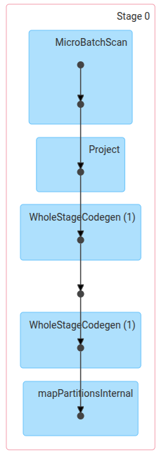

# Лабораторная работа №2
## Стриминговый пайплайн обработки данных на Apache Spark

## 1. Задача

Реализовать стриминговый пайплайн обработки данных на Apache Spark (усложненный вариант):
- Продюсер формирует сообщения на основе датасета и отправляет их в Kafka циклично.
- Spark-приложение читает топик Kafka, обрабатывает сообщения (фильтрация, агрегация, UDF) и записывает результат в PostgreSQL.
- Перед запуском пайплайна в PostgreSQL инициализируются таблицы `city_temperatures` и `avg_temperatures` через `init.sql`.

## 2. Описание датасета

Используется датасет **Daily Temperature of Major Cities** с сайта Kaggle (`city_temperature.csv`).

Структура датасета:

<div align="center">

| Поле            | Тип    | Описание                              |
|-----------------|--------|---------------------------------------|
| Region          | string | Регион (Europe, Asia, Africa и т.д.)  |
| Country         | string | Страна                                |
| State           | string | Штат (для США, иначе пустое)          |
| City            | string | Город                                 |
| Month           | int    | Месяц (1-12)                          |
| Day             | int    | День (1-31)                           |
| Year            | int    | Год                                   |
| AvgTemperature  | double | Средняя температура за день (°F)      |

</div>

## 3. Инициализация базы данных (`init.sql`)

При первом запуске PostgreSQL автоматически выполняет `init.sql`, создавая две таблицы:

```sql
CREATE TABLE IF NOT EXISTS city_temperatures (
    id SERIAL PRIMARY KEY,
    region VARCHAR(100),
    country VARCHAR(100),
    state VARCHAR(100),
    city VARCHAR(200),
    month INT,
    day INT,
    year INT,
    avg_temperature_f DOUBLE PRECISION,
    avg_temperature_c DOUBLE PRECISION,
    batch_time TIMESTAMP DEFAULT NOW()
);

CREATE TABLE IF NOT EXISTS avg_temperatures (
    id SERIAL PRIMARY KEY,
    region VARCHAR(100),
    country VARCHAR(100),
    avg_temp_celsius DOUBLE PRECISION,
    record_count BIGINT,
    batch_time TIMESTAMP DEFAULT NOW()
);
```

- `city_temperatures` — обогащённые записи по каждому городу с температурой в °F и °C.
- `avg_temperatures` — агрегация: средняя температура и количество записей по региону и стране.

## 4. Продюсер (`producer/main.py`)

### Dockerfile

```dockerfile
FROM python:3.11-slim

WORKDIR /app

COPY build/producer/requirements.txt .
RUN pip install --no-cache-dir -r requirements.txt

COPY producer/main.py .

CMD ["python", "main.py"]
```

Зависимости: `kafka-python==2.0.2`.

### Основной код

```python
# Загружаем CSV-файл в список словарей
def load_dataset(path):
    rows = []
    with open(path, "r", encoding="utf-8") as f:
        reader = csv.DictReader(f)
        for row in reader:
            rows.append(row)
    logger.info("Загружено %d строк из %s", len(rows), path)
    return rows


# Циклическая отправка строк в Kafka
def send_rows(producer, rows):
    idx = 0
    while True:
        row = rows[idx]
        message = {
            "Region": row.get("Region", ""),
            "Country": row.get("Country", ""),
            "State": row.get("State", ""),
            "City": row.get("City", ""),
            "Month": int(row.get("Month", 0)),
            "Day": int(row.get("Day", 0)),
            "Year": int(row.get("Year", 0)),
            "AvgTemperature": float(row.get("AvgTemperature", 0)),
        }

        producer.send(KAFKA_TOPIC, value=message)

        if idx % 1000 == 0:
            logger.info(
                "Отправлено сообщение #%d: %s, %s",
                idx,
                message["City"],
                message["Country"],
            )

        idx += 1
        if idx >= len(rows):
            logger.info("Датасет закончился, начинаем с начала")
            idx = 0

        time.sleep(SEND_INTERVAL)


if __name__ == "__main__":
    logger.info("Запуск продюсера")
    producer = KafkaProducer(
        bootstrap_servers=KAFKA_BROKER,
        value_serializer=lambda v: json.dumps(v).encode("utf-8"),
    )
    logger.info("Подключение к Kafka установлено")
    rows = load_dataset(DATA_PATH)
    send_rows(producer, rows)
```

### Алгоритм работы

1. Подключение к Kafka-брокеру (адрес из переменной окружения `KAFKA_BROKER`).
2. Загрузка CSV-файла в память через `csv.DictReader`.
3. Циклическая отправка строк: каждая строка преобразуется в JSON и отправляется в топик. При достижении конца датасета отправка начинается сначала.
4. Интервал между сообщениями задается переменной `SEND_INTERVAL`.

## 5. Spark-приложение (`spark_app/main.py`)

### Основной код

```python
SCHEMA = StructType([
    StructField("Region", StringType()),
    StructField("Country", StringType()),
    StructField("State", StringType()),
    StructField("City", StringType()),
    StructField("Month", IntegerType()),
    StructField("Day", IntegerType()),
    StructField("Year", IntegerType()),
    StructField("AvgTemperature", DoubleType()),
])


# Конвертация температуры из Фаренгейта в Цельсий
@udf(DoubleType())
def fahrenheit_to_celsius(temp_f):
    if temp_f is None:
        return None
    return round((temp_f - 32) * 5.0 / 9.0, 2)

# Запись DataFrame в таблицу PostgreSQL через JDBC
def write_to_postgres(df, table):
    df.write \
        .format("jdbc") \
        .option("url", JDBC_URL) \
        .option("dbtable", table) \
        .option("user", PG_USER) \
        .option("password", PG_PASSWORD) \
        .option("driver", "org.postgresql.Driver") \
        .mode("append") \
        .save()


def process_batch(batch_df, batch_id):
    if batch_df.isEmpty():
        return

    logger.info("Обработка батча #%d, строк: %d", batch_id, batch_df.count())

    VALID_REGIONS = ["Europe", "Asia", "Africa"]
    # Фильтрация: убираем невалидные температуры и оставляем только нужные регионы
    filtered = batch_df.filter(
        (col("AvgTemperature") > -60) & col("Region").isin(VALID_REGIONS)
    )

    if filtered.isEmpty():
        logger.info("Батч #%d: после фильтрации не осталось данных", batch_id)
        return

    # Применяем UDF для конвертации температуры
    enriched = filtered.withColumn(
        "avg_temperature_c", fahrenheit_to_celsius(col("AvgTemperature"))
    )

    # Сохраняем обогащённые записи в таблицу city_temperatures
    city_df = enriched.select(
        col("Region").alias("region"),
        col("Country").alias("country"),
        col("State").alias("state"),
        col("City").alias("city"),
        col("Month").alias("month"),
        col("Day").alias("day"),
        col("Year").alias("year"),
        col("AvgTemperature").alias("avg_temperature_f"),
        col("avg_temperature_c"),
    )
    write_to_postgres(city_df, "city_temperatures")

    # Агрегация: средняя температура по региону и стране
    agg_df = enriched.groupBy("Region", "Country").agg(
        avg("avg_temperature_c").alias("avg_temp_celsius"),
        count("*").alias("record_count"),
    )
    agg_df = agg_df.select(
        col("Region").alias("region"),
        col("Country").alias("country"),
        col("avg_temp_celsius"),
        col("record_count"),
    )
    write_to_postgres(agg_df, "avg_temperatures")

    logger.info("Батч #%d успешно обработан", batch_id)


if __name__ == "__main__":
    logger.info("Запуск Spark-приложения")

    spark = SparkSession.builder \
        .appName("TemperatureStreaming") \
        .getOrCreate()

    spark.sparkContext.setLogLevel("WARN")

    # Чтение потока данных из Kafka
    raw_stream = spark \
        .readStream \
        .format("kafka") \
        .option("kafka.bootstrap.servers", KAFKA_BROKER) \
        .option("subscribe", KAFKA_TOPIC) \
        .option("startingOffsets", "earliest") \
        .option("failOnDataLoss", "false") \
        .load()

    # Парсинг JSON-сообщений из Kafka
    parsed_stream = raw_stream.select(
        from_json(col("value").cast("string"), SCHEMA).alias("data")
    ).select("data.*")

    # Запускаем стриминговый запрос с обработкой батчами
    query = parsed_stream.writeStream \
        .foreachBatch(process_batch) \
        .outputMode("update") \
        .option("checkpointLocation", "/tmp/spark-checkpoint") \
        .trigger(processingTime="10 seconds") \
        .start()

    logger.info("Стриминговый запрос запущен, ожидаем данные...")
    query.awaitTermination()
```

### Описание каждого этапа

1. **Чтение из Kafka** — Spark Structured Streaming подключается к брокеру и подписывается на топик `temperatures`. Читает сообщения начиная с самых ранних (`startingOffsets: earliest`).

2. **Парсинг JSON** — значение каждого Kafka-сообщения (бинарное поле `value`) приводится к строке и разбирается функцией `from_json` по заданной схеме `SCHEMA` в структурированные колонки.

3. **Фильтрация** — отбрасываются записи с невалидной температурой (`AvgTemperature <= -60`, маркер отсутствующих данных в датасете) и записи из регионов, не входящих в список `["Europe", "Asia", "Africa"]`.

4. **UDF `fahrenheit_to_celsius`** — пользовательская функция, конвертирующая температуру из шкалы Фаренгейта в Цельсий по формуле `(F - 32) * 5/9`. Результат добавляется в новую колонку `avg_temperature_c`.

5. **Запись в `city_temperatures`** — обогащённые записи (с обеими шкалами температуры) записываются в PostgreSQL через JDBC.

6. **Агрегация** — вычисляется средняя температура в Цельсии и количество записей в разрезе региона и страны (`groupBy("Region", "Country")`).

7. **Запись в `avg_temperatures`** — агрегированные данные записываются в PostgreSQL через JDBC.

8. **Триггер** — обработка запускается каждые 10 секунд (`trigger(processingTime="10 seconds")`). Чекпоинт сохраняется в `/tmp/spark-checkpoint` для отказоустойчивости.

### DAG выполнения

<div align="center">
  
</div>

DAG содержит один Stage 0 со следующей цепочкой узлов:

- **MicroBatchScan** — чтение очередного микробатча сообщений из Kafka.
- **Project** — парсинг JSON (`from_json`) и проецирование полей по схеме `SCHEMA`.
- **WholeStageCodegen (1)** — первый этап кодогенерации: фильтрация записей по температуре и региону, применение UDF `fahrenheit_to_celsius`.
- **WholeStageCodegen (1)** — второй этап кодогенерации: финальное формирование колонок перед записью.
- **mapPartitionsInternal** — запись результата в PostgreSQL через JDBC партиями.

Stage выполняется заново при каждом срабатывании триггера (каждые 10 секунд).
